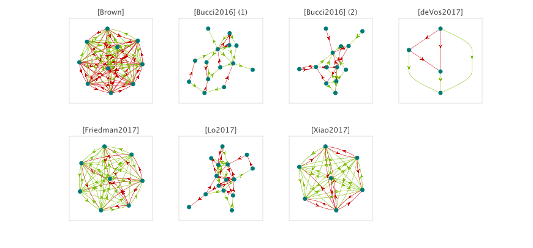
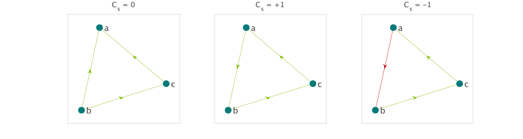

# The Enemy of My Enemy is ?
## Structural Balance in Polymicrobial Networks

---

## Heading 2

### Heading 3

## Equation

$${\textstyle{{d{x_i}} \over {dt}}} = {r_i}{x_i}\left( {1 - \sum\limits_{j = 1}^N {{\alpha _{ij}}{x_j}} } \right)$$

## Signed Clustering Coefficient

$${C_s}(G) = \frac{{\sum\nolimits_{(a,b,c) \in G\;} {\Pi (a,b,c)} }}{{\left\| {\{ \;(a,b,c) \in G\;|\;a \to b \to c\;\} } \right\|}}$$

